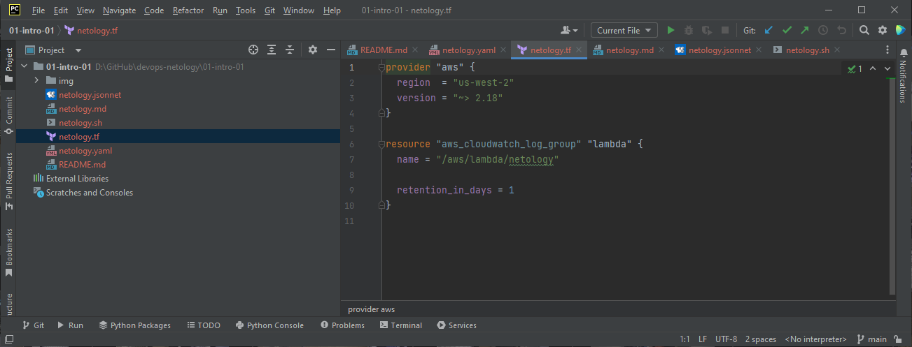
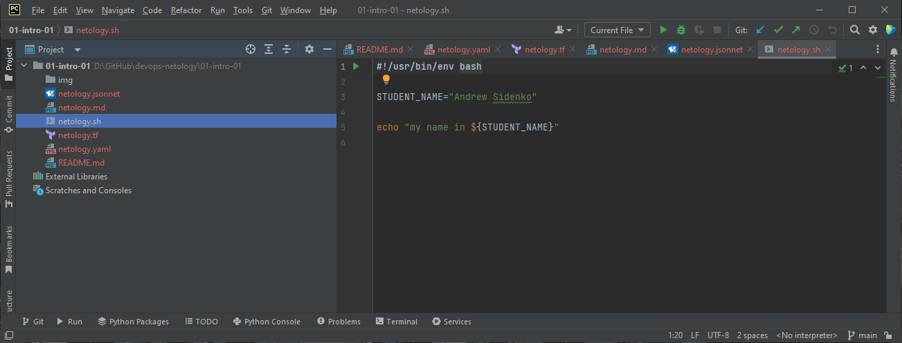
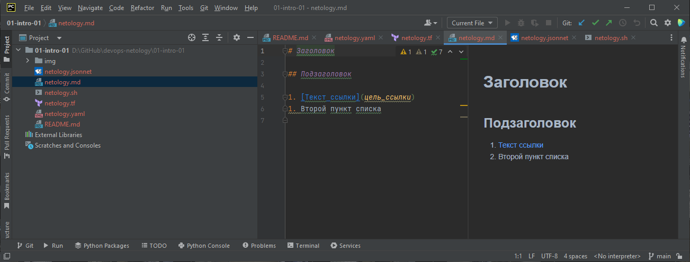
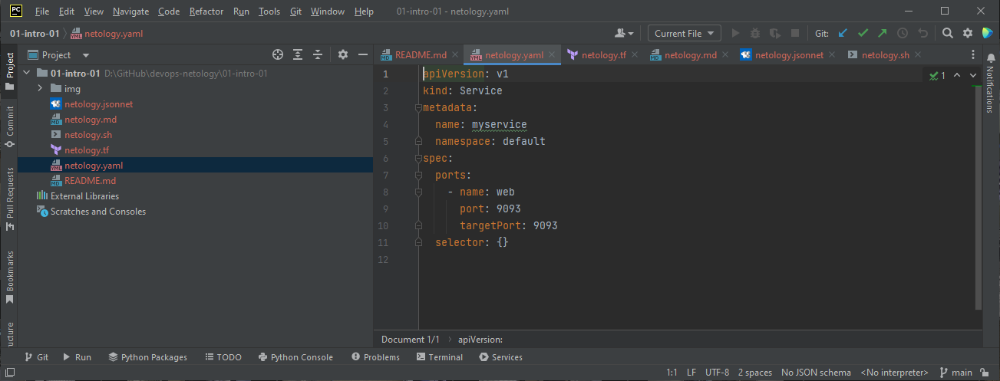
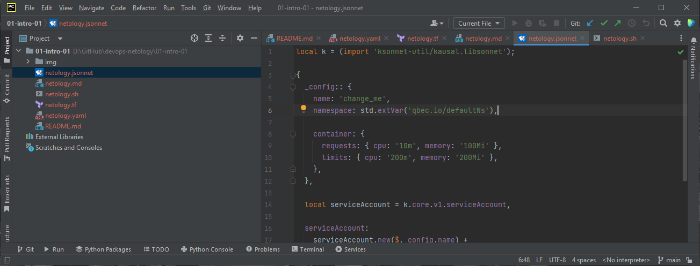

# Домашнее задание к занятию "Введение в DevOps"

## Задание 1. Подготовка рабочей среды

Подсветка синтаксиса работает, файлы выглядят вот так:
- Terraform: 
- Bash: 
- Markdown: 
- Yaml: 
- Jsonnet: 

## Задание 2. Описание жизненного цикла задачи (разработки нового функционала)

1.	Получение менеджером задач от клиента
2.	Коллегиальное обсуждение и планирование нового функционала на текущий спринт
3.	Написание разработчиком кода нового функционала в тестовую ветку
4.	Написание тестировщиком тестов для новых функций
5.	Добавление DevOps’ом новых тестов в автоматизированную песочницу
6.	Выкладка DevOps’ом тестовой ветки в автоматизированную песочницу
7.	Проверка тестировщиком результатов тестирования в автоматизированной песочнице
8.	Проверка менеджером результатов работы нового функционала в автоматизированной песочнице
9.	Решение менеджера о выкладке в продакшн тестовой ветки
10.	Выкладка в продакшн DevOps’ом тестовой ветки, с возможностью отката версии
11.	Презентация менеджером функционала клиенту
12.	Коллегиальное обсуждение результатов и документирование нового функционала
13.	В случае обнаружения критических ошибок клиентом, оповещение менеджера
14.	В случае подтверждения наличия ошибок через логирование, откат изменений
15.	В случае отката изменений, возврат кода на доработку разработчику в п.3 с новой итерацией цикла
16.	В случае отсутствия ошибок итерация считается оконченной и начинается новая с п.1
