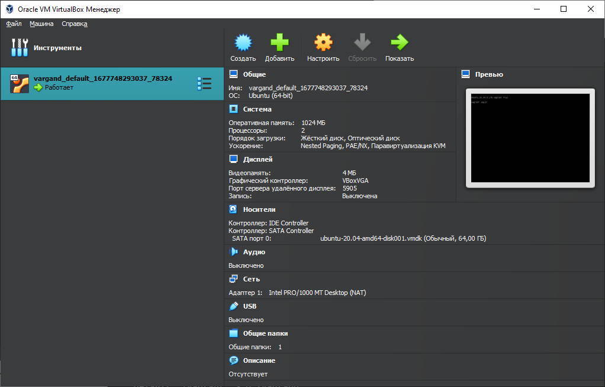

# 1.


# 2.


**Процессор:** 2ЦП предел 100%  
**Оперативная память:** 1024Мб  
**Видео подсиcтема:** VBoxVGA 4Мб   
**Жесткий диск:** SATA VMDK 64Гб    
**Сеть:** NAT   
**Общая папка:** vagrant \\?\D:\vagrant

# 3.


```shell
Vagrant.configure("2") do |config|
 	config.vm.box = "bento/ubuntu-20.04"
	config.vm.provider "virtualbox" do |v|
		v.memory = 2048
		v.cpus = 1
	end
 end   
```
# 4.


# 5.


HISTCONTROL     
ignoreboth = ignorespace + ignoredups       
т.е. игнорируются строки начинающиеся с пробела, а так же дубли.

# 6.

Перечисления - используется для подстановки значений заключенных в скобки.

# 7.

```shell
touch test_{0..100000}
```
300 000 - не получится, т.к. происходит превышение по количеству аргументов.
```shell
vagrant@vagrant:~/test$ getconf ARG_MAX
2097152
```

# 8.


`[[ -d /tmp ]]` - проверяет существует ли каталог tmp в корне ФС.

# 9.

```shell
mkdir /tmp/new_path_directory/
cp /usr/bin/bash /tmp/new_path_directory/bash
export PATH="/tmp/new_path_directory:$PATH"
type -a bash
```
# 10.
Команда at используется для назначения одноразового задания на заданное время, а команда batch — для назначения одноразовых задач, которые должны выполняться, когда загрузка системы становится меньше 0,8
