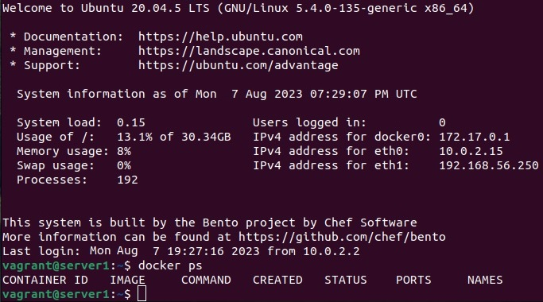

## Домашнее задание к занятию 2. «Применение принципов IaaC в работе с виртуальными машинами»


### Задача 1

* *Опишите основные преимущества применения на практике IaaC-паттернов.*
    * Ускорение развёртывания инфраструктуры под определённые цели.
    * Стабильность среды развертывания, отсутствие разниц в конфигурациях. 
    * Маштабируемость. 
    * Ускорение процесса разработки, тестирования и выпуска релизов продукта.  
* *Какой из принципов IaaC является основополагающим?*
    * *Идемпотентность* - способность данной операции всегда давать один и тот же результат, является важным принципом IaaC. Команда развертывания всегда задает для целевой среды одну и ту же конфигурацию, независимо от начального состояния среды. Идемпотентность достигается путем автоматической настройки существующего целевого объекта.

### Задача 2
* *Чем Ansible выгодно отличается от других систем управление конфигурациями?*
   * Ansible - написан на удобном для понимании языке Phyton, удобен в освоении, имеет низкий порог входа для начала работы с ним,не нужны агенты для работы  
* *Какой, на ваш взгляд, метод работы систем конфигурации более надёжный — push или pull?*
   * Push - имеет одну "точку входа", проще управлять централизовано.

### Задача 3
* *Установите на личный компьютер:*
    * VirtualBox
      ```bash
      root@stas-home:/home/stas# vboxmanage --version
      6.1.38_Ubuntur153438
      ```
    * Vagrant
      ```bash
      root@stas-home:/home/stas# vagrant --version
      Vagrant 2.2.19
      ```
    * Terraform
      ```bash
      root@stas-home:/home/stas# terraform -version
      Terraform v1.4.2
      on linux_amd64
      ```
    * Ansible
      ```bash
      root@stas-home:/home/stas# ansible --version
      ansible [core 2.12.4]
      config file = None
      configured module search path = ['/root/.ansible/plugins/modules', '/usr/share/ansible/plugins/modules']
      ansible python module location = /usr/lib/python3/dist-packages/ansible
      ansible collection location = /root/.ansible/collections:/usr/share/ansible/collections
      executable location = /usr/bin/ansible
      python version = 3.10.7 (main, Nov 24 2022, 19:45:47) [GCC 12.2.0]
      jinja version = 3.0.3
      libyaml = True
      ```
         Приложите вывод команд установленных версий каждой из программ, оформленный в Markdown.

### Задача 4

* *Воспроизведите практическую часть лекции самостоятельно.*
    * Создайте виртуальную машину.
    * Зайдите внутрь ВМ, убедитесь, что Docker установлен с помощью команды

       ```docker ps```

   
