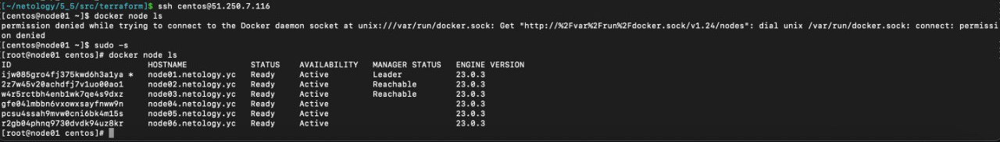
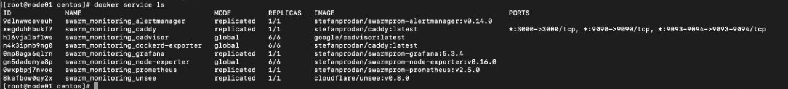

## Домашнее задание к занятию 5. «Оркестрация кластером Docker контейнеров на примере Docker Swarm»

### Задача 1

_Дайте письменые ответы на вопросы:_

* В чём отличие режимов работы сервисов в Docker Swarm-кластере: replication и global?
  * Отличие режимов работы сервисов Docker Swarm кластера заключается, в том, что в режиме global сервис запускается на всех нодах. Если используется режим replication, то указывается количество реплик используемых для сервиса.
* Какой алгоритм выбора лидера используется в Docker Swarm-кластере?
  * Используется так называемый алгоритм поддержания распределенного консенсуса — Raft.
* Что такое Overlay Network?
  * Overlay-сеть - это виртуальная сеть, которую используют контейнеры, связывающая несколько физических хостов, на которых запущен Docker.
  
### Задача 2

_Создайте ваш первый Docker Swarm-кластер в Яндекс Облаке._

Чтобы получить зачёт, предоставьте скриншот из терминала (консоли) с выводом команды:

docker node ls   

 

### Задача 3

_Создайте ваш первый, готовый к боевой эксплуатации кластер мониторинга, состоящий из стека микросервисов._

Чтобы получить зачёт, предоставьте скриншот из терминала (консоли), с выводом команды:

docker service ls   

### Задача 4 (*)

Выполните на лидере Docker Swarm-кластера команду, указанную ниже, и дайте письменное описание её функционала — что она делает и зачем нужна:

* см.документацию: https://docs.docker.com/engine/swarm/swarm_manager_locking/
docker swarm update --autolock=true  